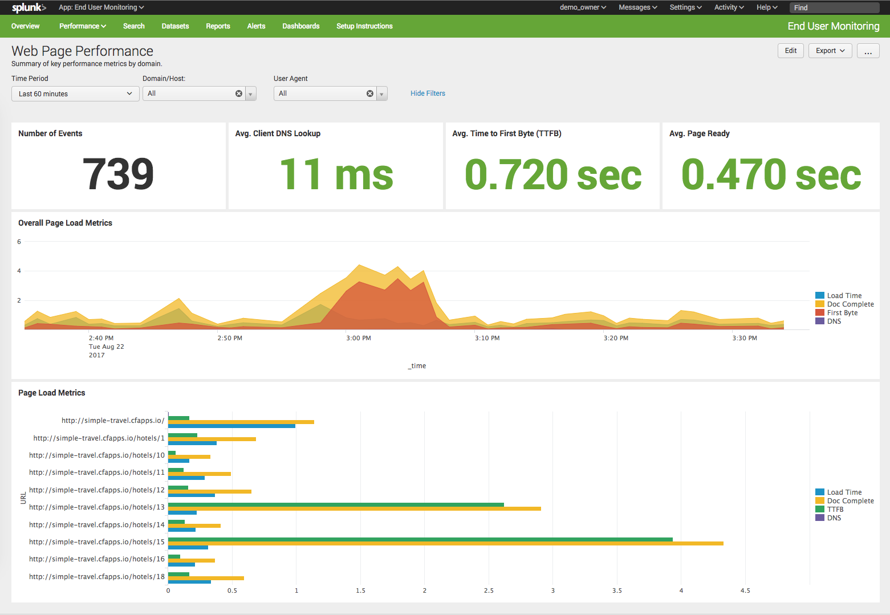

# splunk-boomerang
This is a Splunk Application for visualizing data sent from Boomerang.js

## Installation
- The installation of End User Monitoring consists of 3 parts:
  - Configure an HTTP Event Collector endpoint to recieve the metrics
  - Edit the inputs.conf file for your new HEC input (allow CrossOriginSharingPolicy)
  - Add Boomerang.js to your web pages
  
Detailed installation instructions can be found in the Setup Instructions dashboard in the app.

